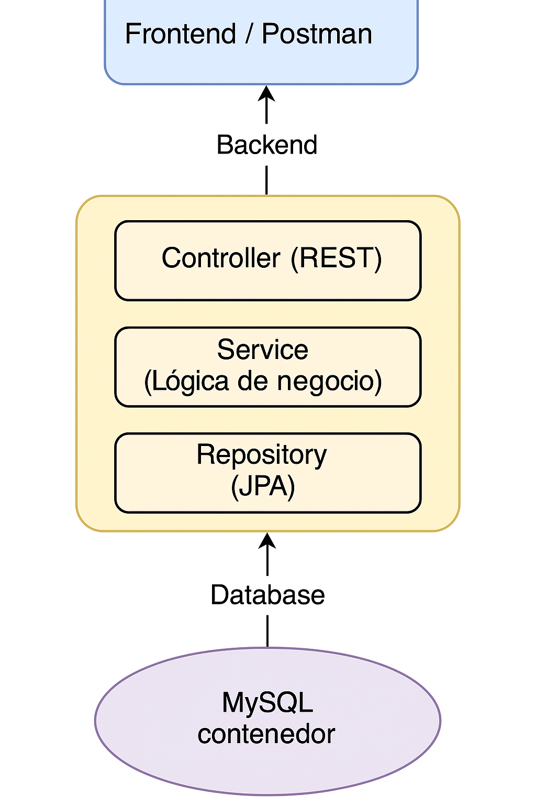

# Challenge Java

Este proyecto es una API REST construida con Spring Boot para la gestión de puntos de venta, acreditaciones y costos de conexión entre dichos puntos, incorporando JWT para autenticación, Swagger UI para documentación, y Docker/Podman para el despliegue.

🌐 Este README también está disponible en [English](README.es.md)
---

## 📖 Módulo teórico

### 1) Tecnologías utilizadas

- **Lenguaje principal:** Java 17
- **Framework:** Spring Boot 3.4.1
- **Base de datos:** MySQL 8 (contenedorizado)
- **ORM:** Spring Data JPA + Hibernate
- **Migrations:** Flyway
- **Autenticación y Seguridad:** Spring Security + JWT (con firma HS256)
- **Documentación:** Swagger UI (vía Springdoc OpenAPI)
- **Contenedores:** Podman (alternativa a Docker)
- **Build Tool:** Maven 3.9.6
- **Testing:** JUnit 5 + Mockito

### 2) Patrones de diseño utilizados

- **Controller-Service-Repository (C-S-R):** organización en capas separadas para manejar responsabilidades.
- **DTO (Data Transfer Object):** para separar entidad y vista, y reducir acoplamiento.
- **Factory Method (en `mapToResponse()`):** para la transformación entre entidades y DTOs.
- **Singleton (con beans Spring):** servicios y repositorios funcionan como singleton gestionados por el contenedor Spring.
- **Builder (parcialmente en JWT):** generación fluida de tokens con la API de `Jwts.builder()`.

### 3) Arquitectura utilizada

- Arquitectura **monolítica** basada en REST.
- **Capas bien definidas:**
   - `controller`: expone los endpoints.
   - `service`: contiene la lógica de negocio.
   - `repository`: accede a la base de datos.
   - `entity`: representa las tablas.
   - `dto`: datos que viajan por la red.
   - `security`: manejo de autenticación JWT y configuración de filtros.
   - `exception`: manejo global de errores.
   - `hateoas`: soporte para enlaces RESTful enriquecidos.

### 4) Resumen de endpoints

#### Autenticación (`/api/auth`)
- `POST /register`: Registrar un nuevo usuario.
- `POST /login`: Iniciar sesión. Devuelve un token JWT.

#### Puntos de venta (`/api/puntos-venta`)
- `GET /`: Listar puntos de venta (token requerido).
- `POST /`: Crear un punto de venta.
- `PUT /{id}`: Actualizar nombre del punto.
- `DELETE /{id}`: Eliminar un punto y sus costos relacionados.

#### Costos (`/api/costos`)
- `POST /`: Agregar costo entre dos puntos (requiere `costo` en query param).
- `DELETE /`: Eliminar el costo entre dos puntos.
- `GET /{idA}`: Listar todos los costos desde un punto A.
- `POST /minimo`: Calcular ruta de costo mínimo entre dos puntos (usando algoritmo de Dijkstra).

#### Acreditaciones (`/api/acreditaciones`)
- `GET /`: Listar todas las acreditaciones registradas.
- `POST /`: Recibir y guardar una nueva acreditación.

## 🧩 Diagrama de arquitectura



---

## 📝 Módulo práctico

### 5) ¿Cómo montar la aplicación desde cero?

**Tecnologías necesarias a instalar en el entorno:**
- [Java 17 SDK](https://jdk.java.net/17/) (específicamente esta versión, ya que el proyecto está construido con Java 17)
- [Apache Maven 3.9.x](https://maven.apache.org/download.cgi) (para compilar y gestionar dependencias)
- [IntelliJ IDEA](https://www.jetbrains.com/idea/) (recomendado como entorno de desarrollo)
- [Spring Boot](https://spring.io/projects/spring-boot) *(no requiere instalación manual)*: todas las dependencias necesarias se descargan automáticamente desde el `pom.xml` al compilar con Maven.
- [Podman](https://podman.io/) (alternativa a Docker, utilizado para levantar los servicios en contenedores)
- [podman-compose](https://github.com/containers/podman-compose) (equivalente a docker-compose, permite orquestar contenedores)
- [MySQL Workbench](https://dev.mysql.com/downloads/workbench/) (opcional, para visualizar y gestionar la base de datos de forma gráfica)
- Conexión a internet para que Maven pueda descargar automáticamente las dependencias del proyecto (Spring Boot, Hibernate, JWT, etc).

**Pasos para montar y ejecutar el proyecto:**
1. Abrir el proyecto en IntelliJ IDEA.
2. Configurar el SDK de Java 17.
3. Verificar que Maven esté activo (usando el archivo `pom.xml`).
4. Asegurarse de que `application.properties` utilice las variables de entorno necesarias (ya están configuradas para usarse con Podman).
5. Ejecutar los siguientes comandos desde la terminal en el directorio raíz del proyecto:

```bash
podman machine init #Para iniciar el podman
podman machine start #Para activar el podman
podman-compose up --detach #Para levantar el proyecto
podman-compose down #Para frenar el proyecto
podman-compose build #Para buildear el proyecto después de un cambio
```
El orden para levantar de cero sería:
1) podman machine init
2) podman machine start
2) podman-compose build
3) podman-compose up --detach
### 6) ¿Cómo visualizar y testear Swagger UI?

**Desde IntelliJ:**
- Plugin `OpenAPI (Swagger) Editor`
- `Tools > OpenAPI (Swagger) Editor > Show Open API Preview`

### 7) ¿Cómo testear cada endpoint en Postman?

**Paso a paso:**
1. Enviar `POST /api/auth/login` con mail y password:
```json
{
   "email": "usuario@mail.com",
   "password": "1234"
}
```
2. Copiar el token devuelto en la propiedad `token`.
3. En Postman, ir a la sección `Authorization` > `Bearer Token` y pegar el token:
```
Bearer eyJhbGciOiJIUzI1NiIsInR5cCI6...
```
4. Usar cualquier endpoint desde la sección `Request` con el token incluido.

**Listado de endpoints con ejemplos para testear:**

#### 🛡️ Autenticación

```http
POST /api/auth/register
Body:
{ "nombre": "Juan", "email": "juan@mail.com", "password": "1234" }

POST /api/auth/login
Body:
{ "email": "juan@mail.com", "password": "1234" }
```

#### 🏬 Puntos de Venta

```http
GET /api/puntos-venta

POST /api/puntos-venta
Body: { "nombre": "Jujuy" }

PUT /api/puntos-venta/1
Body: { "nombre": "Capital Federal" }

DELETE /api/puntos-venta/1
```

#### 💸 Costos entre Puntos

```http
POST /api/costos?costo=10
Body: { "idA": 1, "idB": 4 }

DELETE /api/costos
Body: { "idA": 1, "idB": 4 }

GET /api/costos/1

POST /api/costos/minimo
Body: { "idA": 1, "idB": 5 }
```

#### 🧾 Acreditaciones

```http
GET /api/acreditaciones

POST /api/acreditaciones
Body:
{ "importe": 1500.00, "idPuntoVenta": 2 }
```

💡 Todos los endpoints salvo `/auth/register` y `/auth/login` requieren el token JWT.

---

## 🧪 Tests

Este proyecto incluye pruebas unitarias y de integración utilizando **JUnit 5** y **Mockito**.

- Se testean controllers como `PuntoVentaController`, `CostoPuntosController` y `AcreditacionController`.
- Se testean servicios como `PuntoVentaServiceImpl`, `CostoPuntosServiceImpl` y `AcreditacionServiceImpl`.
- Se mockean dependencias con Mockito (`@Mock`, `@InjectMocks`).
- Se verifica la lógica de negocio, validaciones y manejo de excepciones.
- Coberturas del 100%.
---

## 🔄 CI/CD

Este proyecto integra **GitHub Actions** como herramienta de Integración Continua (CI) para asegurar la calidad y estabilidad del código en cada push o pull request.

### ✅ Descripción del flujo CI

- **Disparador:** Ante cada push o pull request hacia la rama `main`.
- **Pasos:**
  - Configurar el entorno con Java 17.
  - Instalar dependencias del proyecto usando Maven.
  - Ejecutar tests unitarios e integrados con JUnit 5 y Mockito.
  - Verificar que el build se complete exitosamente y reportar los resultados de los tests.

Podés encontrar la definición del workflow en el directorio `.github/workflows/`.

---
## Extras y detalles técnicos

- El token JWT tiene una duración de 10 horas.
- Todos los errores están manejados globalmente desde `GlobalExceptionHandler`.
- Swagger está configurado para persistir autorización JWT (`springdoc.swagger-ui.persistAuthorization=true`).
- Se permite CORS desde `localhost` para facilitar pruebas en entorno local.

---

Si algo no funciona, lo primero que deberías revisar es:
- ⚡ Que el contenedor de MySQL esté corriendo y haya sido creado correctamente.
- 🔐 Que el token JWT sea válido y no esté vencido.
- ✉ Que los datos requeridos (como `nombre`, `importe`, `idA`, `idB`, etc) estén bien formateados en las requests.

Cualquier duda extra, el código está completamente documentado y modularizado, con ejemplos y convenciones claras.

---

## **Contribución y Licencia**


Este proyecto fue realizado como challenge técnico y está pensado como ejemplo profesional de arquitectura Java RESTful con Spring Boot.

Si deseás sugerir mejoras, abrir un issue o realizar un pull request, ¡bienvenido!

---

## 📄 Licencia

Este proyecto se distribuye bajo la licencia MIT. Podés utilizarlo, modificarlo y compartirlo libremente.
Y agregás un archivo LICENSE con la licencia MIT, si querés formalizarlo.
---

## 🔐 Variables de entorno y configuración

Las variables necesarias para la conexión a MySQL y JWT están definidas en `application.properties`.


```properties
spring.application.name=challenge-java
spring.datasource.url=${SPRING_DATASOURCE_URL}
spring.datasource.username=${SPRING_DATASOURCE_USERNAME}
spring.datasource.password=${SPRING_DATASOURCE_PASSWORD}
spring.jpa.hibernate.ddl-auto=update
spring.jpa.properties.hibernate.dialect=org.hibernate.dialect.MySQL8Dialect
spring.datasource.driver-class-name=com.mysql.cj.jdbc.Driver
spring.jpa.show-sql=true
spring.jpa.properties.hibernate.format_sql=true
logging.level.org.flywaydb=DEBUG
spring.flyway.enabled=true
spring.flyway.locations=classpath:db/migration
spring.flyway.baseline-on-migrate=true
logging.level.org.springdoc=DEBUG
logging.level.org.springframework.web=DEBUG
springdoc.swagger-ui.operationsSorter=method
springdoc.swagger-ui.defaultModelsExpandDepth=-1
springdoc.swagger-ui.docExpansion=none
springdoc.swagger-ui.persistAuthorization=true
springdoc.api-docs.path=/v3/api-docs