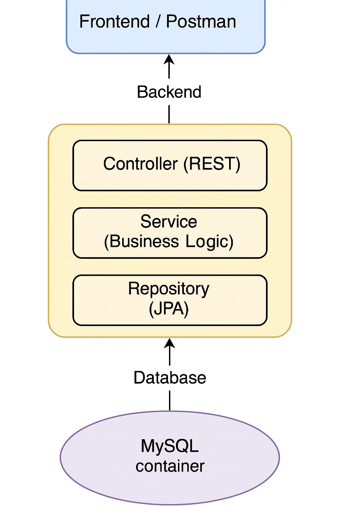

# Challenge Java

This project is a REST API built with Spring Boot for managing sales points, accreditations, and connection costs between them, incorporating JWT for authentication, Swagger UI for documentation, and Docker/Podman for deployment.

🌐 This README is also available in [Spanish 🇪🇸](README.es.md)
---

## 📖 Theoretical Module

### 1) Technologies Used

- **Main language:** Java 17
- **Framework:** Spring Boot 3.4.1
- **Database:** MySQL 8 (containerized)
- **ORM:** Spring Data JPA + Hibernate
- **Migrations:** Flyway
- **Authentication & Security:** Spring Security + JWT (HS256 signature)
- **Documentation:** Swagger UI (via Springdoc OpenAPI)
- **Containers:** Podman (Docker alternative)
- **Build Tool:** Maven 3.9.6
- **Testing:** JUnit 5 + Mockito

### 2) Design Patterns Used

- **Controller-Service-Repository (C-S-R):** layered organization to handle responsibilities.
- **DTO (Data Transfer Object):** to separate entity and view, and reduce coupling.
- **Factory Method (in `mapToResponse()`):** for transforming between entities and DTOs.
- **Singleton (with Spring beans):** services and repositories function as singletons managed by the Spring container.
- **Builder (partially in JWT):** fluent token generation using the `Jwts.builder()` API.

### 3) Architecture Used

- **Monolithic** REST-based architecture.
- **Well-defined layers:**
    - `controller`: exposes the endpoints.
    - `service`: contains the business logic.
    - `repository`: accesses the database.
    - `entity`: represents the tables.
    - `dto`: data transmitted over the network.
    - `security`: handles JWT authentication and filter configuration.
    - `exception`: global error handling.
    - `hateoas`: support for enriched RESTful links.

### 4) Endpoint Summary

#### Authentication (`/api/auth`)
- `POST /register`: Register a new user.
- `POST /login`: Login. Returns a JWT token.

#### Sales Points (`/api/puntos-venta`)
- `GET /`: List sales points (token required).
- `POST /`: Create a sales point.
- `PUT /{id}`: Update point name.
- `DELETE /{id}`: Delete a point and its related costs.

#### Costs (`/api/costos`)
- `POST /`: Add cost between two points (requires `costo` as query param).
- `DELETE /`: Delete the cost between two points.
- `GET /{idA}`: List all costs from point A.
- `POST /minimo`: Calculate minimum cost route between two points (using Dijkstra’s algorithm).

#### Accreditations (`/api/acreditaciones`)
- `GET /`: List all registered accreditations.
- `POST /`: Receive and store a new accreditation.

## 🧩 Architecture Diagram



---

## 📝 Practical Module

### 5) How to Set Up the Application from Scratch?

**Required technologies to install in your environment:**
- [Java 17 SDK](https://jdk.java.net/17/) (specifically this version, as the project is built with Java 17)
- [Apache Maven 3.9.x](https://maven.apache.org/download.cgi) (for building and managing dependencies)
- [IntelliJ IDEA](https://www.jetbrains.com/idea/) (recommended as IDE)
- [Spring Boot](https://spring.io/projects/spring-boot) *(no manual installation required)*: all necessary dependencies are downloaded automatically from `pom.xml` when building with Maven.
- [Podman](https://podman.io/) (Docker alternative, used to launch containerized services)
- [podman-compose](https://github.com/containers/podman-compose) (Docker Compose equivalent, allows orchestrating containers)
- [MySQL Workbench](https://dev.mysql.com/downloads/workbench/) (optional, for graphical visualization and management of the database)
- Internet connection so Maven can automatically download the project dependencies (Spring Boot, Hibernate, JWT, etc).

**Steps to set up and run the project:**
1. Open the project in IntelliJ IDEA.
2. Set up the Java 17 SDK.
3. Ensure Maven is active (via the `pom.xml` file).
4. Make sure `application.properties` uses the required environment variables (already configured to work with Podman).
5. Run the following commands in the terminal from the project root:

```bash
podman machine init #To initialize podman
podman machine start #To start podman
podman-compose up --detach #To launch the project
podman-compose down #To stop the project
podman-compose build #To build the project after a change
```

The correct execution order is:

1. `podman machine init`
2. `podman machine start`
3. `podman-compose build`
4. `podman-compose up --detach`

---

### 6) How to Visualize and Test Swagger UI?

**From IntelliJ:**

- Plugin: `OpenAPI (Swagger) Editor`
- Menu: `Tools > OpenAPI (Swagger) Editor > Show Open API Preview`

---

### 7) How to Test Each Endpoint in Postman?

**Step by Step:**

1. Send `POST /api/auth/login` with email and password:
```json
{
   "email": "usuario@mail.com",
   "password": "1234"
}
```
2. Copy the returned token into the `token` property.
3. In Postman, go to the `Authorization` > `Bearer Token` section and paste the token:
```
Bearer eyJhbGciOiJIUzI1NiIsInR5cCI6...
```
4. Use any endpoint from the `Request` section with the included token.

**List of endpoints with examples for testing:**

#### 🛡️ Authentication
```http
POST /api/auth/register
Body:
{ "nombre": "Juan", "email": "juan@mail.com", "password": "1234" }

POST /api/auth/login
Body:
{ "email": "juan@mail.com", "password": "1234" }
```
#### 🏬 Points of Sale

```http
GET /api/puntos-venta

POST /api/puntos-venta
Body: { "nombre": "Jujuy" }

PUT /api/puntos-venta/1
Body: { "nombre": "Capital Federal" }

DELETE /api/puntos-venta/1
```
#### 💸 Costs between Points

```http
POST /api/costos?costo=10
Body: { "idA": 1, "idB": 4 }

DELETE /api/costos
Body: { "idA": 1, "idB": 4 }

GET /api/costos/1

POST /api/costos/minimo
Body: { "idA": 1, "idB": 5 }
```

#### 🧾 Accreditations

```http
GET /api/acreditaciones

POST /api/acreditaciones
Body:
{ "importe": 1500.00, "idPuntoVenta": 2 }
```
💡 All endpoints except `/auth/register` and `/auth/login` require the JWT token.

---
## 🧪 Tests
This project includes unit and integration tests using **JUnit 5** and **Mockito**.
- Controllers and services are tested.
- Business logic, validations, and exception handling are verified.
- Dependencies are mocked using Mockito.
- Code coverage is close to 100%.


---
## Extras and Technical Details

- The JWT token has a lifetime of 10 hours.
- All errors are handled globally via the `GlobalExceptionHandler`.
- Swagger is configured to persist JWT authorization (`springdoc.swagger-ui.persistAuthorization=true`).
- CORS is allowed from `localhost` to facilitate local testing.

---

If something isn't working, the first thing you should check is:
- ⚡ That the MySQL container is running and has been created correctly.
- 🔐 That the JWT token is valid and hasn't expired.
- ✉ That the required data (such as `nombre`, `monto`, `idA`, `idB`, etc.) is properly formatted in the requests.

If you have any additional questions, the code is fully documented and modularized, with clear examples and conventions.

---
## **Contribution and License**

This project was developed as a technical challenge and is intended as a professional example of Java RESTful architecture with Spring Boot.

If you'd like to suggest improvements, open an issue, or make a pull request, you're welcome!

---

## 📄 License

You are free to use, modify, and distribute this project under the terms of the MIT License.

---

## 🔐 Environment and Configuration Variables

The variables required for connecting to MySQL and JWT are defined in `application.properties`.

```properties
spring.application.name=challenge-java
spring.datasource.url=${SPRING_DATASOURCE_URL}
spring.datasource.username=${SPRING_DATASOURCE_USERNAME}
spring.datasource.password=${SPRING_DATASOURCE_PASSWORD}
spring.jpa.hibernate.ddl-auto=update
spring.jpa.properties.hibernate.dialect=org.hibernate.dialect.MySQL8Dialect
spring.datasource.driver-class-name=com.mysql.cj.jdbc.Driver
spring.jpa.show-sql=true
spring.jpa.properties.hibernate.form t_sql=true
logging.level.org.flywaydb=DEBUG
spring.flyway.enabled=true
spring.flyway.locations=classpath:db/migration
spring.flyway.baseline-on-migrate=true
logging.level.org.springdoc=DEBUG
logging.level.org.springframework.web=DEBUG
springdoc.swagger-ui.operationsSorter=method
springdoc.swagger-ui.defaultModelsExpandDepth=-1
springdoc.swagger-ui.docExpansion=none
springdoc.swagger-ui.persistAuthorization=true
springdoc.api-docs.path=/v3/api-docs